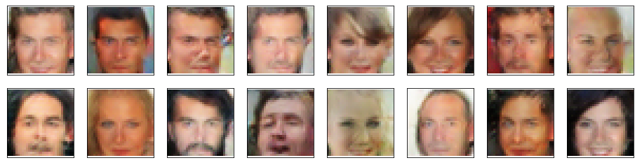

# Face-Generation
The project is part of Bertelsmann Technology Program

# Project Overview
In this project, I defined and trained a DCGAN on a dataset of faces. The goal is to get a generator network to generate new images of faces that look as realistic as possible!

The project is broken down into a series of tasks from loading in data to defining and training adversarial networks. At the end of the notebook, I visualized the results of the trained Generator.

## Generated faces of my DCGAN

